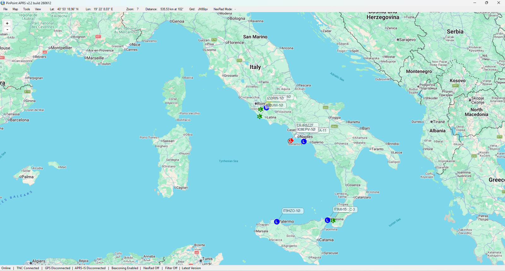
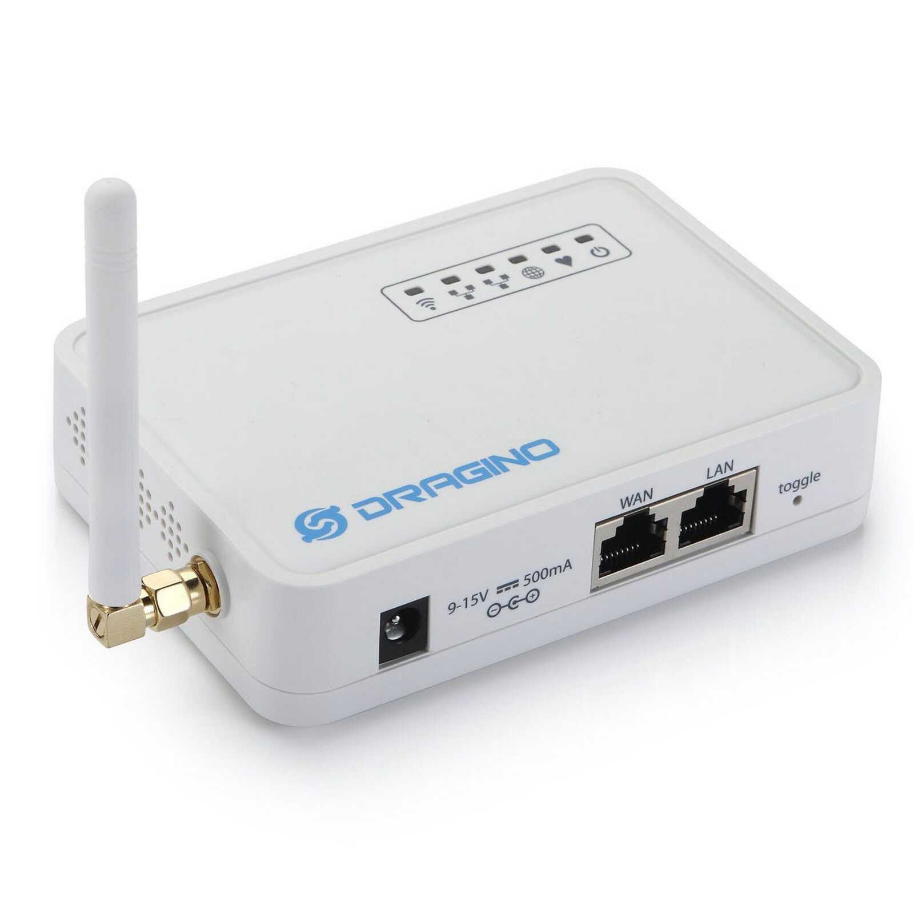

# chimera-rawmodem

🇬🇧 [English version](README.md)

Trasforma un **Dragino LG01-P** in un nodo LoRa raw multi-modalità a
433MHz: KISS TNC su TCP, digipeater APRS standalone + iGate, e interfaccia
di rete Reticulum — niente LoRaWAN, nessun reflash per cambiare modalità.

"Chimera": un dispositivo, tre personalità interoperabili, che condividono
un unico strato firmware da "modem radio raw".

## Perché

L'LG01-P nasce come gateway LoRaWAN a canale singolo. Questo progetto
sostituisce completamente quel caso d'uso ed espone la radio come modem
LoRa raw di uso generale.

A differenza di LG01-N / LG02 (dove l'SX1276 è collegato direttamente al
bus SPI del SoC Linux), **l'LG01-P ha un ATmega328P tra l'AR9331 e la
radio**, il che lo rende architetturalmente un Arduino Yún. Tutto il
controllo radio gira quindi come sketch Arduino sull'ATmega328P; il lato
Linux fa solo da ponte tra il link seriale e la rete. Vedi
[docs/hardware-notes.md](docs/hardware-notes.md) (in inglese).

## Modalità operative

| Modalità | Cosa fa il dispositivo | Lato client |
|---|---|---|
| **TNC** | Espone la radio come KISS TNC su TCP | PinPoint, Xastir, APRSIS32, YAAC, qualsiasi software che parli KISS |
| **Digipeater + iGate** | Digipeater LoRa APRS standalone (WIDEn-N), con inoltro opzionale del traffico ad APRS-IS — e downlink opzionale dei messaggi verso la radio. Digi, iGate e downlink attivabili indipendentemente | Nessuno richiesto (standalone) |
| **Reticulum** | Espone la radio come interfaccia a pacchetti raw per una classe `Interface` RNS custom | `rnsd`, [MeshChat](https://github.com/liamcottle/reticulum-meshchat), [Sideband](https://github.com/markqvist/Sideband) su un host esterno |

In modalità TNC il bridge traduce tra ciò che viaggia in aria e ciò che il
client si aspetta: l'ecosistema LoRa APRS a 433.775 (tracker OE5BPA, nodi
RadioGroup/PIRS…) trasmette pacchetti **testuali** (`<0xFF0x01` + ASCII
TNC2), mentre i client KISS si aspettano frame **AX.25 binari**. Il bridge
converte in modo bidirezionale — il testo ricevuto diventa un frame AX.25
UI corretto (nominativi, path e bit has-been-repeated inclusi), e i beacon
AX.25 del client escono in aria come testo LoRa APRS comprensibile ai nodi
circostanti. Si controlla con `bridge.kiss_text_translation` nella config
(default attivo; disattivalo per avere i payload grezzi). I payload
ricevuti non riconosciuti vengono scartati e loggati invece di essere
inoltrati come spazzatura.

## PinPoint APRS in azione

Stazioni della rete LoRa APRS italiana ricevute e decodificate via KISS TNC:



In modalità Reticulum il dispositivo replica il comportamento on-air del
firmware ufficiale [RNode](https://github.com/markqvist/RNode_Firmware)
(framing PHY da 1 byte, sync word, preambolo — implementati nella classe
interfaccia lato host), quindi scambia traffico Reticulum direttamente con
qualsiasi dispositivo RNode, a parità di parametri radio (frequenza, SF,
BW, CR) — verificato in aria contro un RNode reale (vedi Stato più sotto).

Cambiare personalità è un solo comando sul dispositivo (`chimera-mode
tnc|aprs|reticulum`), persistente ai riavvii — o un click nella web UI.
Nessun reflash necessario.

## Hardware richiesto
 
 
- Dragino **LG01-P**, versione 433MHz (non LG01-N, non LG02 — architettura
  radio diversa e incompatibile)
- Connettività Ethernet per la funzione iGate (altrimenti opzionale)
- Per la modalità Reticulum: un qualsiasi host in rete con RNS (PC,
  homelab, telefono)

Non servono cavo USB né Arduino IDE: è inclusa un'immagine firmware
precompilata e l'ATmega328P si flasha dal Dragino stesso.

## Installazione

Guida completa passo-passo (da dispositivo di fabbrica a nodo funzionante,
con comandi per Linux, macOS e Windows):
**[docs/INSTALL.it.md](docs/INSTALL.it.md)**.

In breve:

1. SSH nel Dragino, liberare la porta seriale interna dal bridge Yún di
   fabbrica, sistemare le impostazioni della console kernel (necessario
   per l'affidabilità al boot).
2. Copiare daemon, script di init e la propria configurazione (creata dai
   template `config/*.example.*` — **mai committare i file reali**).
3. Flashare l'immagine precompilata dello sketch dal Dragino stesso
   (`run-avrdude`), senza USB.
4. `chimera-mode aprs|tnc|reticulum` e via.

## Struttura del repository

```
firmware/atmega328p-modem/   sketch Arduino (uno solo, tutte e 3 le modalità)
firmware/.../prebuilt/       immagini .hex compilate, pronte da flashare
openwrt/bridge/              daemon bridge seriale<->TCP per l'AR9331
openwrt/digipeater/          daemon digipeater APRS standalone
openwrt/igate/               daemon client APRS-IS
openwrt/init.d/              script di avvio OpenWrt
openwrt/chimera-mode         cambio di personalità con un comando
openwrt/luci/                pagina web UI per il cambio modalità
reticulum/interface/         classe Interface RNS custom (gira su host esterno)
config/                      template di configurazione (*.example.*)
docs/                        guida installazione, architettura, note hardware
```

## Stato

In funzione su hardware reale (OpenWrt di fabbrica Chaos Calmer 15.05.1,
Python 2.7):

- **Modalità TNC**: catena completa verificata end-to-end (client TCP →
  bridge → seriale → sketch → radio e ritorno), boot-safe inclusi i test
  di mancanza di corrente.
- **Digipeater + iGate**: installati e attivi su APRS-IS.
- **Modalità Reticulum**: **verificata in aria contro hardware RNode
  reale** (Heltec WiFi LoRa 32 V3, SX1268, firmware RNode 1.86) —
  traffico Reticulum bidirezionale con payload da 64/180/300 byte,
  inclusi i pacchetti split di RNode. Restano aperti il test con una
  board della famiglia SX1276 e le prove di accettazione con
  MeshChat/Sideband — vedi [docs/architecture.md](docs/architecture.md).

## Riconoscimenti

- [Dragino](https://www.dragino.com/) — hardware LG01-P e firmware OpenWrt
- [RadioHead](https://www.airspayce.com/mikem/arduino/RadioHead/) — driver RH_RF95
- [aprs-is.net](https://www.aprs-is.net/) — convenzioni di connessione APRS-IS
- [Reticulum](https://reticulum.network/) / RNode di Mark Qvist

## Autore

IZ0KEW

## Licenza

[GPLv3](LICENSE) — coerente con la maggior parte del software LoRa
radioamatoriale in questo ambito.
